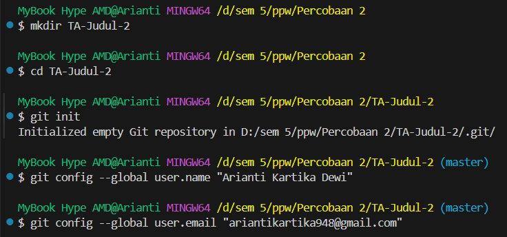
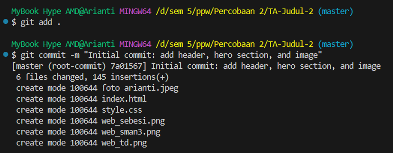
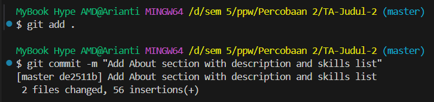
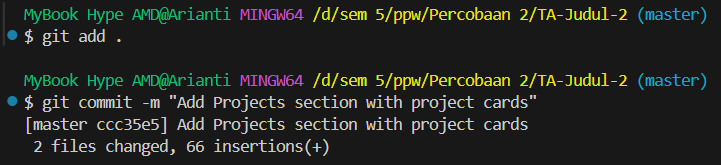
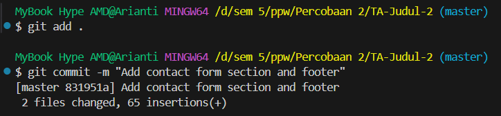
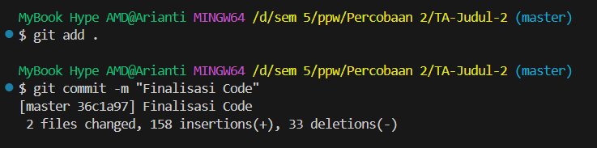
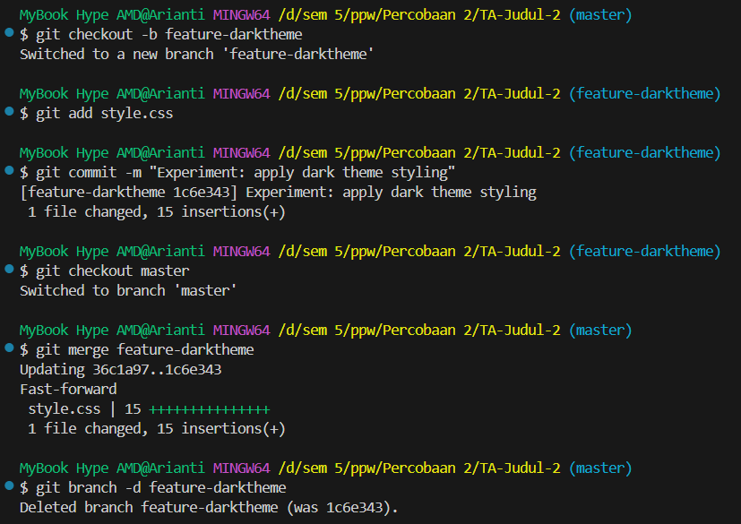
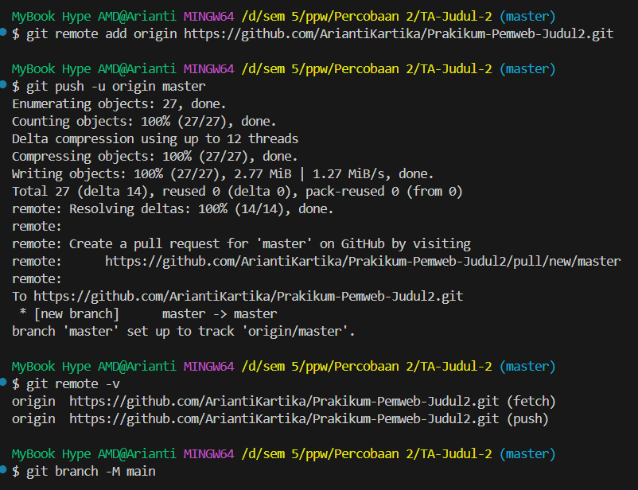
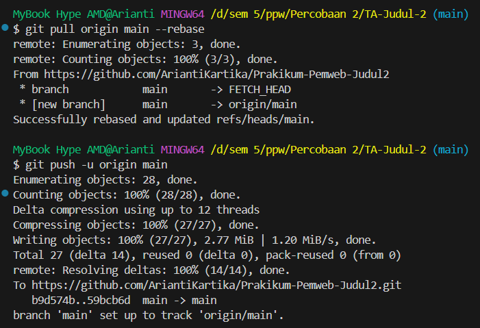
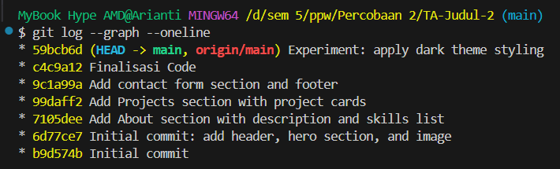

# Prakikum-Pemweb-Judul2
Tugas Akhir Judul 2
# 🌐 Portofolio Website – Arianti Kartika Dewi

Repository ini berisi dokumentasi proses pembuatan website portofolio pribadi menggunakan **HTML dan CSS**, serta penerapan **version control (Git dan GitHub)** pada Tugas Akhir Praktikum Pemrograman Web (Judul 2).

## Identitas
**Nama:** Arianti Kartika Dewi  
**NPM:** 2315061047
**Kelas:** PPW-B

---

## Tujuan
Proyek ini bertujuan untuk:
- Menerapkan konsep **version control (Git)** dalam pengembangan website statis.  
- Mendemonstrasikan tahapan **commit, branching, merge**, dan **sinkronisasi GitHub** secara sistematis.  
- Menunjukkan dokumentasi langkah kerja secara nyata melalui Git.

---

## Langkah-langkah Pengerjaan

### 🧩 **Step 1 – Inisialisasi Repository Git**
- Membuat folder proyek `ta2` dan inisialisasi repository Git menggunakan `git init`.  
- Mengatur username dan email Git.  

```bash
git init
git config user.name "Arianti Kartika Dewi"
git config user.email "ariantikdxx@gmail.com"
```

**Screenshot:**  
  

*Menunjukkan repository lokal berhasil dibuat dan konfigurasi Git telah diatur.*

---

### 💻 **Step 2 – Struktur Dasar Website**
- Membuat dua file utama: `index.html` dan `style.css`.  
- Menambahkan struktur dasar website yang berisi **Header** dan **Hero Section**.  
- Melakukan commit pertama dengan pesan:
```bash
git add .
git commit -m "Initial commit: add header and hero section"
```

**Screenshot:**  
  

*Commit pertama menyimpan versi awal website yang berisi struktur HTML dan CSS utama.*

---

### 🧠 **Step 3 – Section Tentang Saya**
- Menambahkan section **Tentang Saya (About Me)** pada file `index.html` untuk menjelaskan profil pribadi dan daftar keahlian.  
- Memperbarui `style.css` agar tampilan section lebih rapi dan responsif.  
- Menyimpan perubahan dengan commit:
```bash
git add .
git commit -m "Add About section with description and skills list"
```

**Screenshot:**  
  

*Bagian “Tentang Saya” menampilkan deskripsi pribadi, minat, dan keahlian utama dengan gaya tampilan yang menarik.*

---

### 🧱 **Step 4 – Section Proyek Terbaru**
- Menambahkan section **Proyek Terbaru** berisi 3 kartu (card) proyek dengan gambar, judul, dan deskripsi singkat.  
- Melakukan commit untuk mendokumentasikan hasil perubahan:
```bash
git add .
git commit -m "Add Projects section with project cards"
```

**Screenshot:**  
  

*Bagian proyek berfungsi sebagai etalase hasil karya yang telah dibuat, sehingga portofolio menjadi lebih profesional.*

---

### ✉️ **Step 5 – Form Pesan dan Footer**
- Menambahkan **formulir pesan (contact form)** agar pengunjung dapat mengirim pesan.  
- Menambahkan **footer** berisi informasi hak cipta di bagian bawah halaman.  
- Menyimpan perubahan sebagai commit:
```bash
git add .
git commit -m "Add contact form and footer section"
```

**Screenshot:**  
  

*Formulir pesan dan footer menambah nilai interaktif serta tampilan profesional pada website portofolio.*

---

### ✉️ **Step 6 – Finalisasi Code**
- Menambahkan **finalisasi kode** untuk memperbaiki kesalahan minor pada kode.  
- Menyimpan perubahan sebagai commit:
```bash
git add .
git commit -m "Finalisasi Code"
```

**Screenshot:**  
  

*Formulir pesan dan footer menambah nilai interaktif serta tampilan profesional pada website portofolio.*

---

### 🌿 **Step 7 – Branch Baru untuk Penyesuaian Warna**
- Membuat branch baru untuk melakukan eksperimen pada warna tema tanpa mengganggu branch utama.  
- Mengubah kombinasi warna header dan tombol agar tampilan lebih elegan.  
- Melakukan commit di branch baru, kemudian kembali ke main untuk menggabungkannya.
```bash
git branch feature/theme-update
git checkout feature/theme-update
# edit style.css
git add style.css
git commit -m "Update color palette for modern look"
git checkout main
git merge feature/theme-update
git branch -d feature/theme-update
```

**Screenshot:**  
  

*Branch `feature/theme-update` digunakan untuk pengembangan terpisah agar perubahan tidak langsung berdampak ke branch utama.*

---

### 🌐 **Step 8 – Push ke GitHub dan Sinkronisasi**
- Membuat repository baru di GitHub bernama `Praktikum-Pemweb-Judul2`.  
- Menambahkan remote origin dan melakukan push ke GitHub.
```bash
git remote add origin https://github.com/AriantiKartika/Praktikum-Pemweb-Judul2.git
git branch -M main
git pull origin main --rebase
git push -u origin main
```

**Screenshot:**  
  
  
*Website portofolio berhasil diunggah ke GitHub dengan struktur commit yang rapi dan terdokumentasi.*

---

### 📊 **Step 9 – Hasil `git log --graph --oneline`**
- Menampilkan riwayat versi proyek secara visual dan ringkas menggunakan perintah berikut:
```bash
git log --graph --oneline
```

**Screenshot:**  
  

*Grafik menunjukkan alur commit, branch, dan merge yang telah dilakukan selama pengembangan.*

---

## ✅ Kesimpulan
Melalui proyek ini, diperoleh pengalaman langsung dalam:
- Mengelola versi kode menggunakan **Git** dengan langkah-langkah yang terstruktur.  
- Menggunakan **branch dan merge** untuk memisahkan pengembangan fitur.  
- Melakukan **sinkronisasi GitHub** sebagai media kolaborasi dan dokumentasi hasil kerja.

Website portofolio ini menjadi representasi awal kemampuan pengembangan front-end dengan HTML dan CSS yang terorganisir secara profesional melalui version control.

---
